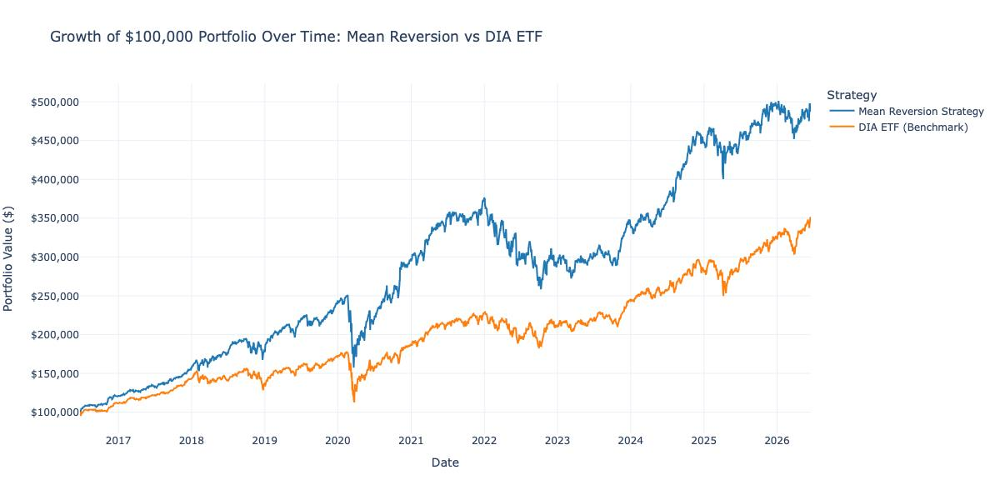
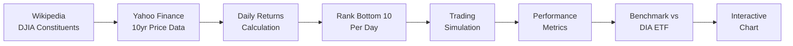

# DJIA Mean Reversion Trading Strategy

A quantitative trading strategy that exploits short-term mean reversion in Dow Jones Industrial Average (DJIA) constituent stocks. The strategy buys the 10 worst-performing stocks each day and sells the next trading day, capitalizing on overnight price recovery.

---

## Strategy Overview

| Parameter | Value |
|---|---|
| **Universe** | 30 DJIA constituent stocks |
| **Signal** | Bottom 10 daily returns |
| **Holding Period** | 1 trading day (overnight) |
| **Position Sizing** | Equal-weight across selected stocks |
| **Backtest Period** | 10 years (~2,510 trading days) |
| **Initial Capital** | $100,000 |

### How It Works

```
For each trading day:
1. Rank all 30 DJIA stocks by daily return (worst to best)
2. Select the 10 stocks with the lowest returns
3. Buy equal-weight positions at close
4. Sell all positions at next day's close
5. Repeat
```

---

## Performance Results

| Metric | Strategy | DIA ETF (Benchmark) | Winner |
|---|---|---|---|
| **Annualized Return** | +17.05% | +13.75% | Strategy |
| **Annualized Volatility** | 20.20% | 17.55% | DIA ETF |
| **Sharpe Ratio (Rf=0)** | 0.8441 | 0.7838 | Strategy |
| **Total Return** | +379.45% | — | — |
| **Final Portfolio Value** | $479,449 | — | — |

> The strategy **outperforms** the DIA benchmark on a risk-adjusted basis (Sharpe delta: +0.0603).

### Performance Chart



---

## Project Structure

```
jordy/
├── README.md                          # This file
├── run_mean_reversion.py              # Standalone execution script
├── mean reversion strategy.ipynb      # Original Jupyter notebook
├── Output.jpeg                        # Performance results chart (image)
└── data/
    └── notebook_files/
        ├── djia_constituents.csv      # DJIA ticker symbols & metadata
        ├── djia_prices.csv            # 10yr adjusted close prices
        ├── djia_daily_returns.csv     # Daily percentage returns
        ├── djia_lowest_10_daily.csv   # Bottom 10 stocks per day
        ├── djia_simulation_results.csv# Daily portfolio capital
        └── performance_chart.html     # Interactive Plotly chart
```

---

## Quick Start

### Prerequisites

- Python 3.10+
- Required packages:

```bash
pip install pandas numpy yfinance requests plotly
```

### Run the Strategy

```bash
python run_mean_reversion.py
```

This will:
1. Fetch DJIA constituents from Wikipedia
2. Download 10 years of adjusted close prices via Yahoo Finance
3. Calculate daily returns and identify bottom-10 performers
4. Run the trading simulation
5. Compute performance metrics (annualized return, volatility, Sharpe ratio)
6. Benchmark against DIA ETF
7. Generate an interactive performance chart (auto-opens in browser)

All output CSVs are saved to `data/notebook_files/`.

---

## Pipeline



---

## Key Assumptions & Limitations

- **No transaction costs** — real-world slippage, commissions, and bid-ask spreads are excluded
- **Fractional shares** — the simulation allows fractional share purchases
- **Close-to-close execution** — assumes trades execute at exact closing prices
- **Survivorship bias** — uses current DJIA constituents for the full backtest period
- **No short selling** — strategy is long-only
- **Implausibility filter** — single-day returns exceeding ±50% are skipped

---

## Data Sources

| Source | Data |
|---|---|
| [Wikipedia](https://en.wikipedia.org/wiki/Dow_Jones_Industrial_Average) | DJIA constituent tickers |
| [Yahoo Finance](https://finance.yahoo.com/) (via `yfinance`) | Historical adjusted close prices |

---

## Tech Stack

- **Python 3.12** — core language
- **pandas** — data manipulation & time series
- **NumPy** — numerical computation
- **yfinance** — market data API
- **Plotly** — interactive visualization
- **requests** — web scraping

---

## License

This project is for **educational and research purposes only**. It does not constitute financial advice. Past performance does not guarantee future results.